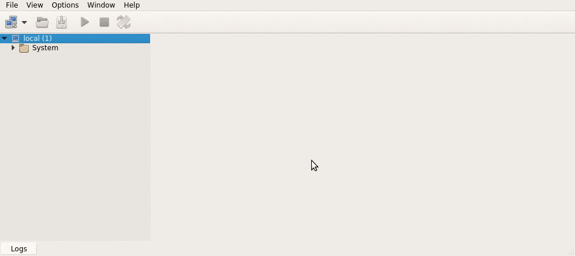

# Alumnos de una facultad - Ejemplo puro en MongoDB

## Objetivo
muestra cómo generar una [base de alumnos que cursan materias de una facultad](https://github.com/uqbar-project/eg-alumnos-mongodb/wiki/Enunciado-Alumnos) en MongoDB.

## Modelo
El modelo de datos se estructura en un documento que contiene: 

* el nombre de la materia, 
* el curso 
* y un alumno del cual conocemos 
 * su nombre 
 * y los parciales (nota y fecha del examen).
 
## Instalación
Antes de correr los test, tenés que instalar una base de datos [MongoDB Community Edition](https://www.mongodb.com/) y levantar el server. En Windows, [levantan el servicio mongod](https://docs.mongodb.com/manual/tutorial/install-mongodb-on-windows/), en Linux desde una línea de comandos hacen

```bash
$ sudo service mongod start
```

Hay dos archivos que contienen scripts para ejecutar directamente en una base MongoDB:

* [Insert alumnos](scripts/Insert alumnos.txt) permite generar un juego de datos con dos cursos de Diseño de Sistemas
* [Queries alumnos](scripts/Queries Alumnos.txt) resuelve 5 requerimientos (cada uno se explica dentro del mismo archivo). Se puede copiar y pegar en un shell de Mongo uno por uno.

Te mostramos cómo correr los scripts con [Robomongo](https://robomongo.org/) un cliente MongoDB con algunas prestaciones gráficas:


